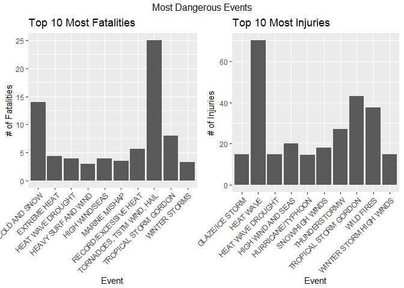

# Catastropic Storms
Nikolai Alexander  
10/29/2017  
  
## Introduction

For this assignment, we are looking for which storms are the most catastrophic. In order to find this, we need to look at 2 categories: **harm to population health** and **economic destruction**.

## Data Processing

The first thing we need to do is load the data set. This is pretty easy, as it is a csv file. However, it is hidden inside of a *bz2* file. Easy fix; tell R that this file is a *bz* file:

```r
  data <- read.csv(bzfile("StormData.csv.bz2"), stringsAsFactors = FALSE)
  head(data)
```

```
##   STATE__           BGN_DATE BGN_TIME TIME_ZONE COUNTY COUNTYNAME STATE
## 1       1  4/18/1950 0:00:00     0130       CST     97     MOBILE    AL
## 2       1  4/18/1950 0:00:00     0145       CST      3    BALDWIN    AL
## 3       1  2/20/1951 0:00:00     1600       CST     57    FAYETTE    AL
## 4       1   6/8/1951 0:00:00     0900       CST     89    MADISON    AL
## 5       1 11/15/1951 0:00:00     1500       CST     43    CULLMAN    AL
## 6       1 11/15/1951 0:00:00     2000       CST     77 LAUDERDALE    AL
##    EVTYPE BGN_RANGE BGN_AZI BGN_LOCATI END_DATE END_TIME COUNTY_END
## 1 TORNADO         0                                               0
## 2 TORNADO         0                                               0
## 3 TORNADO         0                                               0
## 4 TORNADO         0                                               0
## 5 TORNADO         0                                               0
## 6 TORNADO         0                                               0
##   COUNTYENDN END_RANGE END_AZI END_LOCATI LENGTH WIDTH F MAG FATALITIES
## 1         NA         0                      14.0   100 3   0          0
## 2         NA         0                       2.0   150 2   0          0
## 3         NA         0                       0.1   123 2   0          0
## 4         NA         0                       0.0   100 2   0          0
## 5         NA         0                       0.0   150 2   0          0
## 6         NA         0                       1.5   177 2   0          0
##   INJURIES PROPDMG PROPDMGEXP CROPDMG CROPDMGEXP WFO STATEOFFIC ZONENAMES
## 1       15    25.0          K       0                                    
## 2        0     2.5          K       0                                    
## 3        2    25.0          K       0                                    
## 4        2     2.5          K       0                                    
## 5        2     2.5          K       0                                    
## 6        6     2.5          K       0                                    
##   LATITUDE LONGITUDE LATITUDE_E LONGITUDE_ REMARKS REFNUM
## 1     3040      8812       3051       8806              1
## 2     3042      8755          0          0              2
## 3     3340      8742          0          0              3
## 4     3458      8626          0          0              4
## 5     3412      8642          0          0              5
## 6     3450      8748          0          0              6
```

Since there seems to be a lot of data here, we can look at the column names to see what we need.

```r
  colnames(data)
```

```
##  [1] "STATE__"    "BGN_DATE"   "BGN_TIME"   "TIME_ZONE"  "COUNTY"    
##  [6] "COUNTYNAME" "STATE"      "EVTYPE"     "BGN_RANGE"  "BGN_AZI"   
## [11] "BGN_LOCATI" "END_DATE"   "END_TIME"   "COUNTY_END" "COUNTYENDN"
## [16] "END_RANGE"  "END_AZI"    "END_LOCATI" "LENGTH"     "WIDTH"     
## [21] "F"          "MAG"        "FATALITIES" "INJURIES"   "PROPDMG"   
## [26] "PROPDMGEXP" "CROPDMG"    "CROPDMGEXP" "WFO"        "STATEOFFIC"
## [31] "ZONENAMES"  "LATITUDE"   "LONGITUDE"  "LATITUDE_E" "LONGITUDE_"
## [36] "REMARKS"    "REFNUM"
```

For this analysis, we only care about they type of storm, the data involving personal health, and destruction costs. So we only need the columns: *EVTYPE*, *FATALITIES*, *INJURIES*, *PROPDMG*, *PROPDMGEXP*, *CROPDMG*, and *CROPDMGEXP*. So, we can clean up this data set to make it easier to read:

```r
  colnames(data) <- tolower(colnames(data))
  clean_data <- data.frame(
      data$evtype,
      data$fatalities,
      data$injuries,
      data$propdmg,
      data$propdmgexp,
      data$cropdmg,
      data$cropdmgexp,
      stringsAsFactors = FALSE
    )
  colnames(clean_data) <- gsub("data.","", colnames(clean_data))

  head(clean_data)
```

```
##    evtype fatalities injuries propdmg propdmgexp cropdmg cropdmgexp
## 1 TORNADO          0       15    25.0          K       0           
## 2 TORNADO          0        0     2.5          K       0           
## 3 TORNADO          0        2    25.0          K       0           
## 4 TORNADO          0        2     2.5          K       0           
## 5 TORNADO          0        2     2.5          K       0           
## 6 TORNADO          0        6     2.5          K       0
```

This data set is much easier to look at... There is only one thing... *propdmgexp* and *cropdmgexp* are character variables, when they should be exponents to the *propdmg* and *cropdmg*. In order to change these to numbers, we first need to look at what values there are:

```r
  unique(clean_data$propdmgexp)
```

```
##  [1] "K" "M" ""  "B" "m" "+" "0" "5" "6" "?" "4" "2" "3" "h" "7" "H" "-"
## [18] "1" "8"
```

```r
  unique(clean_data$cropdmgexp)
```

```
## [1] ""  "M" "K" "m" "B" "?" "0" "k" "2"
```

Now that we can see the character values, we need to assign them to numerical values. Some values are weird (i.e. *?*, *+*, etc.); we can assign these values to 0.


```r
  clean_data$propdmgexp[clean_data$propdmgexp == "B"] = 9
  clean_data$propdmgexp[clean_data$propdmgexp == "h" | clean_data$propdmgexp == "H"] = 2
  clean_data$propdmgexp[clean_data$propdmgexp == "K"] = 3
  clean_data$propdmgexp[clean_data$propdmgexp == "m" | clean_data$propdmgexp == "M"] = 6
  clean_data$propdmgexp[
    clean_data$propdmgexp == "+" |
    clean_data$propdmgexp == "?"|
    clean_data$propdmgexp == "-"
  ] = NA
 clean_data$propdmgexp[clean_data$propdmgexp == ""] = 0  
  clean_data$propdmgexp <- as.numeric(clean_data$propdmgexp)

  unique(clean_data$propdmgexp)
```

```
##  [1]  3  6  0  9 NA  5  4  2  7  1  8
```

```r
  clean_data$cropdmgexp[clean_data$cropdmgexp == ""] = 0
  clean_data$cropdmgexp[clean_data$cropdmgexp == "M" | clean_data$cropdmgexp == "m"] = 6
  clean_data$cropdmgexp[clean_data$cropdmgexp == "K" | clean_data$cropdmgexp == "k"] = 3
  clean_data$cropdmgexp[clean_data$cropdmgexp == "B"] = 9
  clean_data$cropdmgexp[clean_data$cropdmgexp == "?"] = NA
  clean_data$cropdmgexp <- as.numeric(clean_data$cropdmgexp)
  
  unique(clean_data$cropdmgexp)
```

```
## [1]  0  6  3  9 NA  2
```

Now we want to factor *propdmgexp* and *cropdmgexp* into *propdmg* and *cropdmg*, but first we need to make sure *propdmg* and *cropdmg* are numerical.

```r
  class(clean_data$propdmg)
```

```
## [1] "numeric"
```

```r
  class(clean_data$cropdmg)
```

```
## [1] "numeric"
```

Since these are both numeric, we can carry on with combining the columns.

```r
  clean_data$propdmg = clean_data$propdmg * 10^clean_data$propdmgexp

  clean_data$cropdmg = clean_data$cropdmg * 10^clean_data$cropdmgexp

  final_data = data.frame(
    clean_data$evtype,
    clean_data$fatalities,
    clean_data$injuries,
    clean_data$propdmg,
    clean_data$cropdmg,
    stringsAsFactors = FALSE
    )  
  colnames(final_data) <- gsub("clean_data.","", colnames(final_data))

  head(final_data)
```

```
##    evtype fatalities injuries propdmg cropdmg
## 1 TORNADO          0       15   25000       0
## 2 TORNADO          0        0    2500       0
## 3 TORNADO          0        2   25000       0
## 4 TORNADO          0        2    2500       0
## 5 TORNADO          0        2    2500       0
## 6 TORNADO          0        6    2500       0
```

Finally, we need to ask ourselves, what is the best way to find the most destructive storms, both economically and physically? My solution is to find the mean of each variable according to each storm. 

```r
  mean_data <- aggregate(
    final_data,
    by = list(final_data$evtype),
    mean
  )
  mean_data$evtype <- NULL
  colnames(mean_data)<- gsub("Group.1","evtype", colnames(mean_data))

  mean_data$evtype <- toupper(mean_data$evtype)
  
  head(mean_data)
```

```
##                  evtype fatalities injuries propdmg cropdmg
## 1    HIGH SURF ADVISORY          0        0  200000       0
## 2         COASTAL FLOOD          0        0       0       0
## 3           FLASH FLOOD          0        0   50000       0
## 4             LIGHTNING          0        0       0       0
## 5             TSTM WIND          0        0 2025000       0
## 6       TSTM WIND (G45)          0        0    8000       0
```

Now, we have a clean data set that we can use to answer the following questions!

## Results
### Across the United States, which types of events are most harmful with respect to population health?

To answer this question, we need to look at the *fatalities* and *injuries* column; specifically the highest rates. In order to do this, first we need to sort the dataframe in terms of these values.


```r
  fatal_df <- mean_data[with(mean_data, order(-fatalities)),]

head(fatal_df)
```

```
##                         evtype fatalities  injuries      propdmg   cropdmg
## 842 TORNADOES, TSTM WIND, HAIL  25.000000  0.000000 1.600000e+09 2500000.0
## 72               COLD AND SNOW  14.000000  0.000000 0.000000e+00       0.0
## 851      TROPICAL STORM GORDON   8.000000 43.000000 5.000000e+05  500000.0
## 580      RECORD/EXCESSIVE HEAT   5.666667  0.000000 0.000000e+00       0.0
## 142               EXTREME HEAT   4.363636  7.045455 5.227273e+03  227272.7
## 279          HEAT WAVE DROUGHT   4.000000 15.000000 2.000000e+05   50000.0
```


```r
  inj_df <- mean_data[with(mean_data, order(-injuries)),]

head(inj_df)
```

```
##                    evtype fatalities injuries   propdmg cropdmg
## 277             HEAT WAVE       0.00     70.0         0   0e+00
## 851 TROPICAL STORM GORDON       8.00     43.0    500000   5e+05
## 954            WILD FIRES       0.75     37.5 156025000   0e+00
## 821         THUNDERSTORMW       0.00     27.0    125000   0e+00
## 366    HIGH WIND AND SEAS       3.00     20.0     50000   0e+00
## 656       SNOW/HIGH WINDS       0.00     18.0     50000   0e+00
```

So we now have 2 data frames, sorted from most fatalities and most injuries. Now we can look at a graph. However, there are many many storms. Let's just look at the top 10.


```r
  top_fatal <- fatal_df[1:10,]

  print(top_fatal)
```

```
##                         evtype fatalities  injuries      propdmg   cropdmg
## 842 TORNADOES, TSTM WIND, HAIL  25.000000  0.000000 1.600000e+09 2500000.0
## 72               COLD AND SNOW  14.000000  0.000000 0.000000e+00       0.0
## 851      TROPICAL STORM GORDON   8.000000 43.000000 5.000000e+05  500000.0
## 580      RECORD/EXCESSIVE HEAT   5.666667  0.000000 0.000000e+00       0.0
## 142               EXTREME HEAT   4.363636  7.045455 5.227273e+03  227272.7
## 279          HEAT WAVE DROUGHT   4.000000 15.000000 2.000000e+05   50000.0
## 373             HIGH WIND/SEAS   4.000000  0.000000 5.000000e+05       0.0
## 487              MARINE MISHAP   3.500000  2.500000 0.000000e+00       0.0
## 976              WINTER STORMS   3.333333  5.666667 1.666667e+05  166666.7
## 340        HEAVY SURF AND WIND   3.000000  0.000000 0.000000e+00       0.0
```

```r
  top_inj <- inj_df[1:10,]
  
  print(top_inj)
```

```
##                      evtype fatalities injuries   propdmg  cropdmg
## 277               HEAT WAVE  0.0000000 70.00000         0        0
## 851   TROPICAL STORM GORDON  8.0000000 43.00000    500000   500000
## 954              WILD FIRES  0.7500000 37.50000 156025000        0
## 821           THUNDERSTORMW  0.0000000 27.00000    125000        0
## 366      HIGH WIND AND SEAS  3.0000000 20.00000     50000        0
## 656         SNOW/HIGH WINDS  0.0000000 18.00000     50000        0
## 224         GLAZE/ICE STORM  0.0000000 15.00000         0        0
## 279       HEAT WAVE DROUGHT  4.0000000 15.00000    200000    50000
## 973 WINTER STORM HIGH WINDS  1.0000000 15.00000  60000000  5000000
## 411       HURRICANE/TYPHOON  0.7272727 14.48864 787566364 29634918
```

Now we can compare graphs...

```r
  library(ggplot2)
  library(gridExtra)

  fatal_bar <- ggplot()+
    geom_bar(
      data = top_fatal, 
      aes(x = evtype, y = fatalities),
      stat = "identity"
    )+
    xlab("Event")+
    ylab("# of Fatalities")+
    ggtitle("Top 10 Most Fatalities")+
    theme(
      axis.text.x = element_text(angle = 45, hjust = 1)
    )
  
  inj_bar <- ggplot()+
    geom_bar(
      data = top_inj,
      aes(x = evtype, y = injuries),
      stat = "identity"
    )+
    xlab("Event")+
    ylab("# of Injuries")+
    ggtitle("Top 10 Most Injuries")+
    theme(
      axis.text.x = element_text(angle = 45, hjust = 1)
    )
  
  grid.arrange(fatal_bar, inj_bar, ncol = 2, top = "Most Dangerous Events")
```

<!-- -->

There, now we have the most harmful events to physical health. Tornadoes have the most fatalies, with 25 fatalities, and Heat Waves have the highest rate of injury, with 70 injuries. However Tropical Storm Gordon is no event to be ignored either, making the top three in both injuries (43) and fatalities (8).

### Across the United States, which types of events have the greatest economic consequences?

For this, we are going through a similar process of analysing the data as we did when looking physical harm caused by the events. However, we are looking at the economic cost of the events. So this time, we only care about the *propdmg* and *cropdmg*. Let's look back at original mean data frame.

```r
  head(mean_data)
```

```
##                  evtype fatalities injuries propdmg cropdmg
## 1    HIGH SURF ADVISORY          0        0  200000       0
## 2         COASTAL FLOOD          0        0       0       0
## 3           FLASH FLOOD          0        0   50000       0
## 4             LIGHTNING          0        0       0       0
## 5             TSTM WIND          0        0 2025000       0
## 6       TSTM WIND (G45)          0        0    8000       0
```

Since we are looking at the total economic damage of the events, we can find the sum of *propdmg* and *cropdmg* to make the analysis easier.

```r
  tot_dmg <- data.frame(
    mean_data$evtype,
    mean_data$propdmg + mean_data$cropdmg
  )
 colnames(tot_dmg) <- c("evtype", "totdmg")

 tot_dmg <- tot_dmg[with(tot_dmg, order(-totdmg)),] 

 head(tot_dmg)
```

```
##                         evtype     totdmg
## 842 TORNADOES, TSTM WIND, HAIL 1602500000
## 298  HEAVY RAIN/SEVERE WEATHER 1250000000
## 411          HURRICANE/TYPHOON  817201282
## 409             HURRICANE OPAL  354649556
## 670                STORM SURGE  165990579
## 954                 WILD FIRES  156025000
```

Now, we have the data sorted from the most amount of economic damage to the least. Again, we only need to look at the top 10, so we can pull that from the data frame.


```r
  top_dmg <- tot_dmg[1:10,]

  print(top_dmg)
```

```
##                         evtype     totdmg
## 842 TORNADOES, TSTM WIND, HAIL 1602500000
## 298  HEAVY RAIN/SEVERE WEATHER 1250000000
## 411          HURRICANE/TYPHOON  817201282
## 409             HURRICANE OPAL  354649556
## 670                STORM SURGE  165990579
## 954                 WILD FIRES  156025000
## 136          EXCESSIVE WETNESS  142000000
## 410  HURRICANE OPAL/HIGH WINDS  110000000
## 604        SEVERE THUNDERSTORM   92735385
## 402                  HURRICANE   83966833
```

To visualize this data, we should look at another bar plot comparing the 10. However, as you can see, the total damage is pretty high for many of these (some in the billions!). To make the graph easier to read, we can divide *totdmg* by 1 billion.


```r
  ggplot()+
    geom_bar(
      data = top_dmg,
      aes(x = evtype, y = totdmg/10^9),
      stat = "identity"
    )+
    xlab("Event")+
    ylab("Total Damage in Billions ($B)")+
    ggtitle("Top 10 Most Economically Damaging Events")+
    theme(
      axis.text.x = element_text(angle = 45, hjust = 1)
    )
```

<!-- -->

Tornadoes win again with 1.6 billion dollars in damage. Heavy rain comes in a close second with 1.2 billion dollars in damage.
